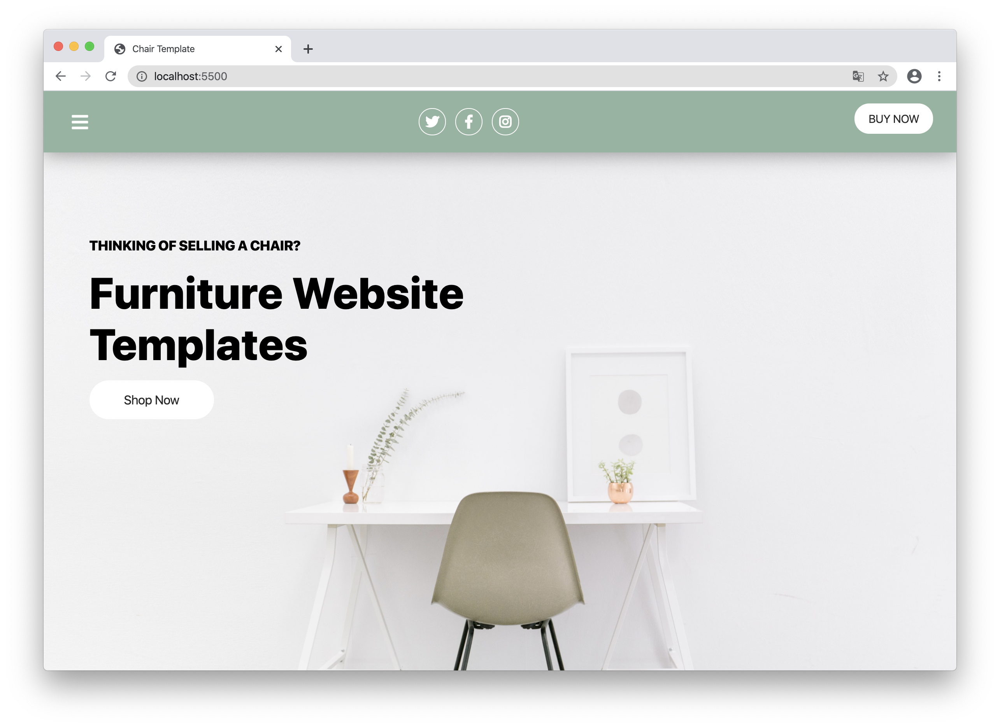
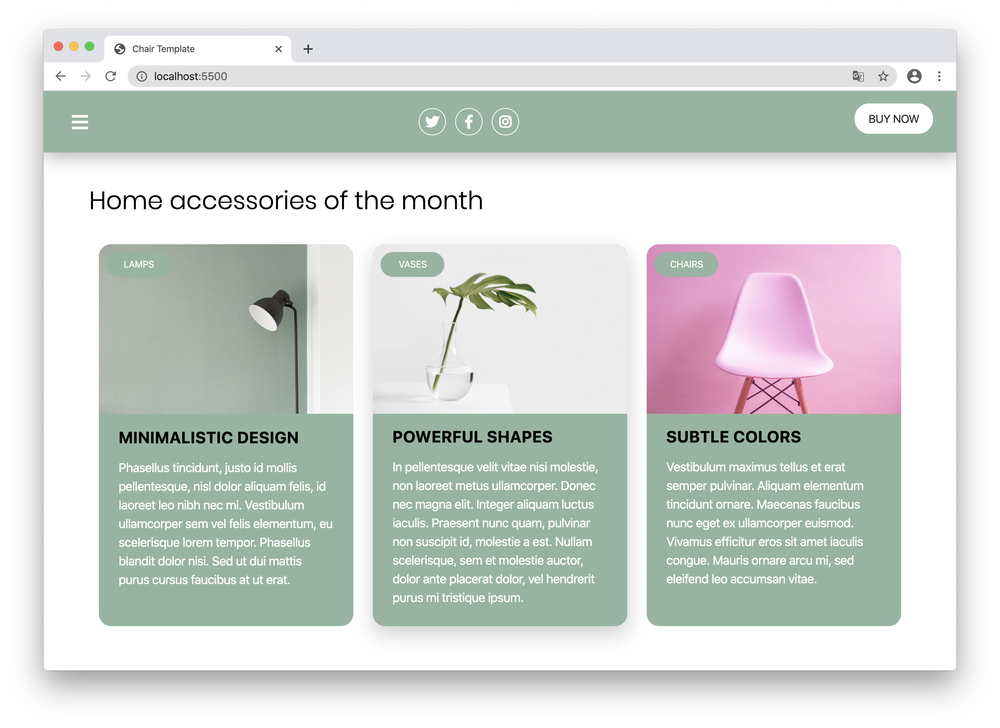
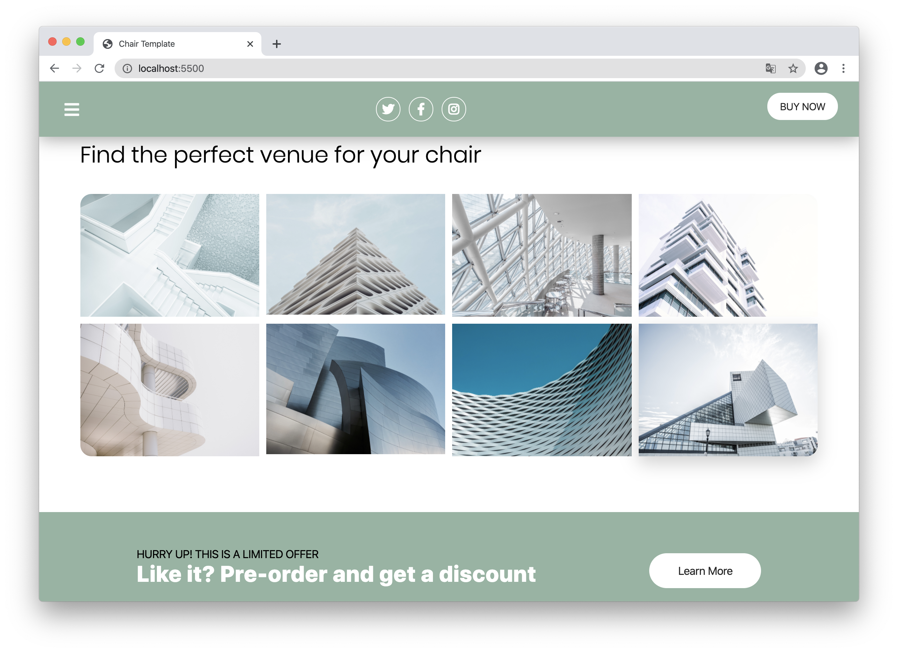

## Chair Template
This is a fully responsive prototype for a template once requested by a friend. In the end he decided to go with another template, so I've decided upload this one for anyone who wants to continue to use it. It is written in plain HTML5 CSS3.

## Structure
- CSS selectors are sorted by specificity and dependend on appearance on the page.
- All colors and some general metrics for sizing are saved in CSS variables to give a consistent and easy to manipulate look.
- (You need to download Fontawesome. It won't be included in this repo.)

## Screenshots

Have fun with it!